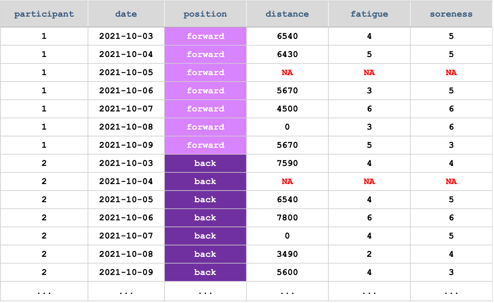
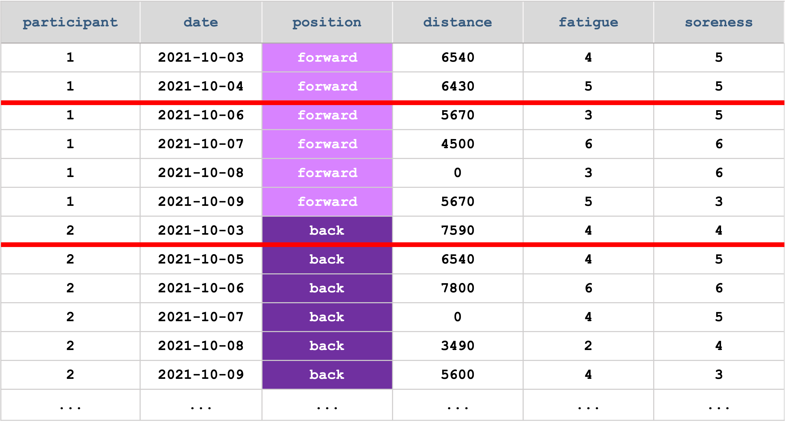
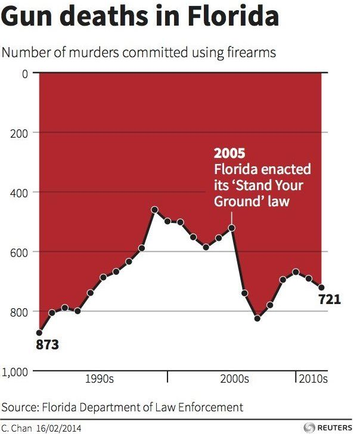

```{r setup, include=FALSE}
options(htmltools.dir.version = FALSE)
knitr::opts_chunk$set(
  fig.width=7, fig.height=3.5, fig.retina=3,
  fig.align = "center",
  out.width = "80%",
  cache = FALSE,
  echo = FALSE,
  message = FALSE, 
  warning = FALSE,
  hiline = TRUE
)
```

```{r colour-palette, include=FALSE, warning=FALSE}
# colour palette from here https://pin.it/4ezMyLd
colors = c(
  dark_blue = "#1A535C",
  light_blue = "#4ECDC4",
  off_white = "#F7FFF7",
  red = "#FF6B6B",
  yellow = "#FFE66D"
)
```

```{r xaringan-themer, include=FALSE, warning=FALSE}
library(xaringanthemer)
style_duo_accent(
  primary_color = colors[["dark_blue"]],
  secondary_color = colors[["light_blue"]],
  white_color = "#FFFFFF", # just white
  black_color = "#000000", # just black
  text_color = colors[["dark_blue"]],
  inverse_header_color = "#FFFFFF",
  code_inline_color = colors[["light_blue"]],
  link_color = colors[["light_blue"]],
  header_font_google = google_font("Roboto"),
  text_font_google = google_font("Karla"),
  code_font_google = google_font("Fira Mono"),
  text_font_size = "1.5rem"
)
```

```{r packages, include=FALSE}
# packages
library(tidyverse)
library(ggridges)
library(gghalves)
```

```{r data, include=FALSE}
# get data
raiders <- read_csv("data/raiders-data.csv") %>%
  mutate(Timepoint = factor(Timepoint, levels = c("Pre", "Post")),
         Playing_Position = factor(Playing_Position, labels = c("Forward", "Back")))

injuries <- read_csv("data/injury-data.csv")
```


## What we think data analysis is like

```{r, out.width='100%'}

```

---

## What it's actually like

```{r, out.width='70%'}

```
---

class: inverse center middle

# Research Questions

---

class: center middle

# Write down your research question 

--

```{r, out.width='50%'}

```

---

class: inverse center middle

# Getting to know your variables 

---

class: center middle

# Write down your independent and dependent variables

--

```{r, out.width='50%'}

```

---

## Types of variables and their properties

```{r}

```

---

## Types of variables and their properties

```{r}

```

---

## Types of variables and their properties

```{r}

```

---

## Types of variables and their properties

```{r}

```

---
## Nominal example

```{r}

```

---

## Ordinal example

```{r, out.width='40%'}

```


---

## Interval example

```{r, out.width='50%'}

```

---

## Ratio examples

- Time (e.g. in secs) to complete a task &#x1F551;
--

- Distance run (e.g. in metres) &#x1F3C3;
--

- Force produced (e.g. in N) &#x1F4AA;
--

- Cerebral blood flow &#x1F9E0; 
--

- A whole bunch of other lab and field-based measures 

---

## What types of variables will you be collecting?

```{r}

```

---
class: inverse center middle

# Setting up your data so your future self won't hate you


---

## Tidy data

```{r, out.width='90%'}

```

---

## Tidy data (continued)

```{r}
knitr::include_graphics("fig/long-format-ex1.png")
```

---

## Long format example 1

```{r}
knitr::include_graphics("fig/long-format-ex1.png")
```

---

## Long format example 2

```{r}

```

---

## Wide format example

```{r, out.width='100%'}

```


---
class: inverse center middle

# Missing values 

---

## Explicitly missing values example 1

```{r}

```

---

## Explicitly missing values example 2

```{r}

```


---


## Implicitly missing values

```{r}

```


---

class: inverse center middle

# Being a data explorer 

---
# Exploratory data analysis checklist

- Visualise your data
--

- Identify patterns in your data (e.g. variance, covariance)
--

- Check for missing values
--

- Check for measurement errors
--

- Check for outliers

---

class: inverse center middle

# Being a data viz wiz &#x1F9D9;

---

## The right viz for the right job

```{r}

```

---

class: inverse center middle

# Let's go to the bar (plot)

---

## A bar plot

Bar plots can be used to show the distribution of **categorical variables**

```{r, out.width='80%'}
pos_colours <- c("#1a535c", "#4ecdc4")

ggplot(data = raiders, aes(x = Playing_Position, fill = Playing_Position)) +
  geom_bar(width = 0.8) + 
  labs(x = "Playing Position", y = "Number of Participants") +
  scale_fill_manual(values = pos_colours) +
  scale_y_continuous(limits = c(0,40)) +
  theme(legend.position = "none")
  
```

---

## A stacked barplot

A stacked barplot can be used to show 2 categorical variables

```{r}
inj_colours <- c("#ef767a", "#456990")

injuries %>%
  count(position, injury_status) %>%
  group_by(position) %>%
  mutate(percent = round(prop.table(n)*100, 1)) %>%
  
  ggplot() +
  geom_bar(aes(x = position, y = n, fill = injury_status), 
           stat = "identity") +
  labs(x = "Playing Position", y = "Number of participants", fill = "Injury Status") +
  scale_fill_manual(values = inj_colours)
```

---

## A better stacked barplot

Use a stacked barplot when showing **proportions** of 2 categorical variables

```{r,}
injuries %>%
  count(position, injury_status) %>%
  group_by(position) %>%
  mutate(percent = round(prop.table(n), 2)) %>%

  ggplot(aes(x = position, y = percent, fill = injury_status)) +
  geom_bar(stat = "identity") +
  labs(x = "Position", y = "Proportion", fill = "Injury Status") +
  scale_fill_manual(values = inj_colours)
```

---

## A barplot with dodging

Use a barplot with dodging when showing **counts** of 2 categorical variables

```{r}
injuries %>%
  count(position, injury_status) %>%
  group_by(position) %>%
  
  ggplot() +
  geom_bar(aes(x = position, y = n, fill = injury_status), 
           stat = "identity", position = "dodge") +
  labs(x = "Position", y = "Number of observations", fill = "Injury Status") +
  scale_fill_manual(values = inj_colours)
```

---

## Death to pie charts

<br>

```{r, out.width='90%'}

```

---
class: center inverse middle

# #grammin with histograms

---

## A histogram

Histograms can be used to inspect the distribution of **continuous variables**

```{r}
ggplot(data = raiders, aes(x = `1200mTimeTrial`)) +
  geom_histogram(binwidth = 5, colour = "#1a535c", fill = "#4ecdc4") +
  labs(x = "Time Trial (s)", y = "N Observations")
```

---

## Bin widths

Check that adjusting the binwidth doesn't change your interpretation of the
distribution

```{r}
ggplot(data = raiders, aes(x = `1200mTimeTrial`)) +
  geom_histogram(binwidth = 10, colour = "#1a535c", fill = "#4ecdc4") +
  labs(x = "Time Trial (s)", y = "Frequency")
```

---

class: inverse center middle

# Comparing groups

---

## Death to dynamite charts

Don't use a bar plot and error bars for continuous variables 

```{r}
raiders %>%
  group_by(Playing_Position) %>%
  summarise(mn = mean(`1200mTimeTrial`, na.rm = TRUE), 
            sd = sd(`1200mTimeTrial`, na.rm = TRUE)) %>%
  
  ggplot(aes(x = Playing_Position)) + 
  geom_bar(aes(y = mn, fill = Playing_Position), stat = "identity", 
           width = 0.7) +
  geom_errorbar(aes(ymin = mn - sd, ymax = mn + sd + 20, colour = Playing_Position), 
                width = 0.5, size = 1) +
  scale_fill_manual(values = pos_colours) +
  scale_colour_manual(values = pos_colours) +
  scale_x_discrete(labels = c("Treatment", "Control")) +
  labs(y = "Time Trial (s)", x = "Group") +
  theme(legend.position = "none")
```

---

## A histogram with facets

What these distributions really look like

```{r}
ggplot(data = raiders, aes(x = `1200mTimeTrial`, 
                           fill = Playing_Position, 
                           colour = Playing_Position)) +
  geom_histogram(binwidth = 10, alpha = 0.7) +
  scale_fill_manual(values = pos_colours) +
  scale_colour_manual(values = pos_colours) +
  facet_wrap(~Playing_Position, 
             labeller = as_labeller(c(Forward = "Treatment", 
                                      Back = "Control"))) +
  labs(x = "Time Trial (s)", y = "Number of observations") +
  theme(legend.position = "none")
```

---

## A boxplot

A boxplot can be used to compare the 5-number summary of a continuous variable between groups

```{r}
raiders %>%
  ggplot(aes(x = Playing_Position, y = `1200mTimeTrial`, 
             fill = Playing_Position)) +
  geom_boxplot() +
  labs(x = "Group", y = "Time trial (s)") +
  scale_fill_manual(values = pos_colours) +
  scale_x_discrete(labels = c("Treatment", "Control")) +
  theme(legend.position = "none")
```


---
## A raincloud plot

If you want to be really creative and make your reviewers say "o0o0o0o0o"

```{r}
raiders %>%
  ggplot(aes(x = Playing_Position, y = `1200mTimeTrial`, 
             fill = Playing_Position)) +
  geom_half_point(side = "1") +
  geom_half_boxplot(side = "1", width = 0.5, alpha = 0.3, nudge = 0.1) +
  geom_half_violin(side = "r") +
  labs(x = "Group", y = "Time trial (s)") +
  scale_fill_manual(values = pos_colours) +
  scale_x_discrete(labels = c("Treatment", "Control")) +
  theme(legend.position = "none")
```


---

## Axis scales

Limit your axes to values that make sense for your variables

```{r}
raiders %>%
  ggplot(aes(x = Playing_Position, y = `1200mTimeTrial`, fill = Playing_Position)) +
  geom_boxplot() +
  scale_y_continuous(limits = c(0, 320)) +
  labs(x = "Position", y = "Time trial (s)") +
  scale_fill_manual(values = pos_colours) +
  theme(legend.position = "none")
```

---

## Flipping the axis

Flipping the axis *might* be suitable in some situations

```{r}
raiders %>%
  ggplot(aes(x = Playing_Position, y = `1200mTimeTrial`, fill = Playing_Position)) +
  geom_boxplot() +
  scale_y_reverse() +
  labs(x = "Group", y = "Time trial (s)", 
       caption = "Note: The y axis has been inverted for interpretability as a lower time indicates a higher speed.") +
  scale_fill_manual(values = pos_colours) +
  scale_x_discrete(labels = c("Treatment", "Control")) +
  theme(legend.position = "none", 
        plot.caption = element_text(hjust = 0.5))
```

---

## Flipping the axis

But don't be a jerk about it. With great data comes great responsibility.

```{r, out.width='35%'}

```

---

## Comparing timepoints

Sometimes the techniques used to compare groups can also be used to compare timepoints

```{r}
time_colours <- c("#087ca7", "#033860")

raiders %>%
  ggplot(aes(x = Timepoint, y = `1200mTimeTrial`, fill = Timepoint)) +
  geom_boxplot() +
  labs(x = "Timepoint", y = "Time trial (s)") +
  scale_fill_manual(values = inj_colours) +
  theme(legend.position = "none")
```

---

## Comparing timepoints

Connect repeated measures for participants to better show how individuals have
responded

```{r}
raiders %>%
  ggplot(aes(x = Timepoint, y = `1200mTimeTrial`), colour = "#033860") +
  geom_point(colour = "#033860") +
  geom_line(aes(group = ID), colour = "#033860") +
  labs(x = "Timepoint", y = "Time trial (s)")
```

---

## Using facets to add more dimensions


```{r}
raiders %>%
  ggplot(aes(x = Timepoint, y = `1200mTimeTrial`, colour = Playing_Position)) +
  geom_point() +
  geom_line(aes(group = ID)) +
  labs(x = "Timepoint", y = "Time trial (s)") +
  facet_wrap(~Playing_Position) +
  scale_colour_manual(values = pos_colours) +
  theme(legend.position = "none")
```

---

## Using colour to add more dimensions

```{r}
raiders %>%
  ggplot(aes(x = Timepoint, y = `1200mTimeTrial`, fill = Playing_Position)) +
  geom_boxplot() +
  labs(x = "Timepoint", y = "Time trial (s)", fill = "Group") +
  scale_fill_manual(values = pos_colours, labels = c("Treatment", "Control"))
```

---

## Some resources for picking colour

- [How to choose a colour palette](https://blog.datawrapper.de/beautifulcolors/)
- [Colour palette generator](https://learnui.design/tools/data-color-picker.html)


---

class: inverse center middle

# Some final advice

---
class: center middle

# If you torture data long enough it will tell you anything you want to hear


---
class: center middle

# Don't be a stargazer &#x1F929;

---
class: inverse center middle

```{r, out.width='60%'}
knitr::include_graphics("fig/you-got-this.gif")
```
---